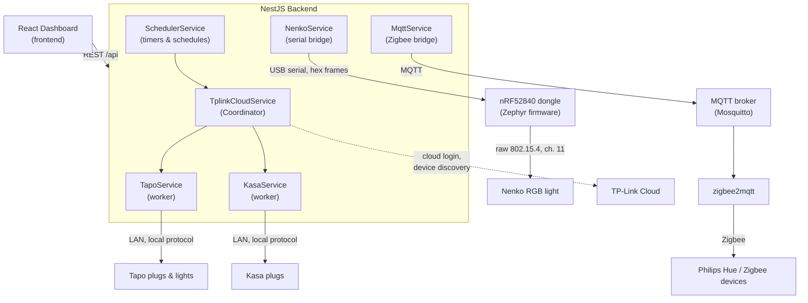

# DOMOS

> A unified, multi-vendor smart-home dashboard — control and coordinate IoT devices of **different brands** and **different communication protocols** from a single interface.

DOMOS hides the fragmentation of the consumer smart-home market behind one consistent UI and one consistent REST API. Whether a device speaks the TP-Link Tapo local protocol, the Kasa protocol, Zigbee (through `zigbee2mqtt`), or nothing at all — like the Nenko light, which is driven by replaying its remote's raw 802.15.4 frames — the dashboard treats it as a single normalized `SmartDevice`: toggle it, dim it, recolor it, schedule it, and read its energy usage — all the same way.

This repository is the codebase of a bachelor's thesis project.

---

## Table of contents

- [Features](#features)
- [Architecture](#architecture)
- [Supported devices & protocols](#supported-devices--protocols)
- [Tech stack](#tech-stack)
- [Repository structure](#repository-structure)
- [Getting started](#getting-started)
- [Configuration](#configuration)
- [REST API](#rest-api)
- [Scheduling](#scheduling)
- [Testing](#testing)
- [Notes & limitations](#notes--limitations)

---

## Features

- **Multi-vendor control** — TP-Link Tapo, TP-Link Kasa, Philips Hue (Zigbee), and a Nenko RGB light from one dashboard.
- **Protocol abstraction** — the backend normalizes every device into a single shape; the frontend never needs to know how a device is reached.
- **Power control** — turn smart plugs and lights on/off.
- **Light control** — brightness and color for LED bulbs/strips, with brightness and color sliders.
- **RF frame replay** — a closed device with no API (the Nenko light) is controlled by re-transmitting its remote's captured 802.15.4 frames through a custom-firmware nRF52840 dongle.
- **Energy monitoring** — live power (W), today's / this month's consumption (kWh), and voltage for plugs that support metering.
- **Device info** — firmware, Wi-Fi signal/RSSI, uptime, overheating, SSID.
- **One-shot timers** — "turn this off in 30 minutes", scheduled and executed server-side.
- **Recurring schedules** — turn a device on/off at a given time on selected weekdays.
- **Resilient** — if the MQTT broker is down, Zigbee devices are simply omitted; if the nRF dongle is unplugged, the Nenko service stays dormant; the rest of the dashboard keeps working.

## Architecture

DOMOS is a monorepo with three parts:

- **`backend/`** — a [NestJS](https://nestjs.com/) server that acts as the **unification layer**. It exposes a single REST API and routes each command to the right protocol implementation.
- **`frontend/`** — a [React](https://react.dev/) + [Vite](https://vite.dev/) single-page dashboard that talks only to the backend.
- **`firmware/`** — a [Zephyr](https://zephyrproject.org/) application that turns an nRF52840 USB dongle into a raw 802.15.4 transmitter, used by the backend as a serial peripheral.

The backend follows a **coordinator / worker** pattern:



**How the coordinator works** (`TplinkCloudService`):

1. Logs into the **TP-Link cloud** once to *discover* the account's devices (session cached ~30 min, device list cached ~5 min). The discovered catalog is persisted to `devices-info.json`.
2. Maps each cloud `deviceId` to a **local LAN IP** using `device-config.json`.
3. Detects whether a device is **Tapo** or **Kasa** from its model/type.
4. Delegates every actual command to the matching **local worker** (`TapoService` / `KasaService`) — control happens **on the LAN**, not through the cloud.

**Zigbee** is handled separately by `MqttService`, which connects to an MQTT broker, subscribes to the `zigbee2mqtt` topics, keeps an in-memory catalog and per-device state, converts units (brightness `0–254 ↔ 0–100%`, color CIE-xy / HSV → hex), and publishes `.../set` commands.

**Nenko** is handled by `NenkoService`, for a light that exposes no API at all. Its remote's 802.15.4 frames were captured live with an nRF 802.15.4 sniffer and stored in `nenko-buttons.json` (one entry per remote button: label, kind, RGB, and the MAC frame in hex **without FCS**). To run a preset, the service writes the corresponding hex line to the dongle over USB serial; the Zephyr firmware re-transmits those exact bytes on channel 11 and replies `OK <n> byte`. Writes are queued one at a time because the firmware is single-buffered.

## Supported devices & protocols

| Brand / family | Transport | Library | Capabilities |
| --- | --- | --- | --- |
| **TP-Link Tapo** (plugs, L-series LED lights/strips) | Local LAN | [`tp-link-tapo-connect`](https://www.npmjs.com/package/tp-link-tapo-connect) | on/off, brightness, color, energy, info |
| **TP-Link Kasa** (HS/KP plugs) | Local LAN | [`tplink-smarthome-api`](https://www.npmjs.com/package/tplink-smarthome-api) | on/off, energy, info |
| **Philips Hue & other Zigbee** | MQTT via [`zigbee2mqtt`](https://www.zigbee2mqtt.io/) | [`mqtt`](https://www.npmjs.com/package/mqtt) | on/off, brightness, color |
| **Nenko RGB light** (no API) | USB serial → raw 802.15.4 | [`serialport`](https://www.npmjs.com/package/serialport) + custom nRF52840 firmware | color & effect presets (frame replay) |

> Zigbee support requires an external Zigbee coordinator (e.g. a Sonoff USB dongle), a running `zigbee2mqtt` instance, and an MQTT broker (e.g. [Mosquitto](https://mosquitto.org/)).
>
> Nenko support requires an nRF52840 USB dongle flashed with the firmware in [`firmware/nenko/`](firmware/nenko/README.md).

## Tech stack

**Backend** — NestJS 11 · TypeScript · RxJS · mqtt.js · serialport · Jest (unit tests with mock devices)
**Frontend** — React 19 · Vite · TypeScript · Tailwind CSS v4
**Firmware** — C · Zephyr / nRF Connect SDK v3.1.1 (USB CDC ACM + `ieee802154` radio driver)

## Repository structure

```
DOMOS/
├── backend/                      # NestJS API (the unification layer)
│   ├── src/
│   │   ├── main.ts               # bootstrap (port 3000, CORS enabled)
│   │   └── devices/
│   │       ├── app.module.ts     # root module
│   │       ├── tplink-cloud/     # Coordinator: discovery + command routing  → /api/tapo
│   │       ├── tapo/             # Tapo local worker
│   │       ├── kasa/             # Kasa local worker
│   │       ├── zigbee/           # MQTT service + controller                  → /api/zigbee
│   │       ├── nenko/            # Serial bridge + captured frame map         → /api/nenko
│   │       └── scheduler/        # Server-side timers & schedules             → /api/scheduler
│   ├── device-config.json        # deviceId → local LAN IP  (you provide this)
│   ├── devices-info.json         # cached device catalog (auto-generated)
│   ├── schedules.json            # persisted timers & schedules (auto-generated)
│   └── .env                      # credentials & broker config (you provide this)
│
├── firmware/
│   └── nenko/                    # Zephyr app: nRF52840 dongle as an 802.15.4 modem
│       ├── src/main.c            # USB CDC ACM → raw TX on channel 11
│       ├── prj.conf              # Zephyr configuration
│       └── build/nenko.uf2       # prebuilt, flashable artifact
│
└── frontend/                     # React + Vite dashboard
    ├── .env                      # VITE_API_BASE (backend URL)
    └── src/
        ├── views/Dashboard.tsx   # main screen
        ├── api/domosClient.ts    # REST client, normalizes every device
        ├── hooks/                # useDevices, useScheduler, useEnergy, useDeviceInfo, useNenko
        ├── components/           # DeviceCard, DeviceDetailModal, LightControls, NenkoCard, …
        └── types/types.ts        # SmartDevice and shared types
```

## Getting started

### Prerequisites

- **Node.js 20+** and npm
- A **TP-Link account** (for Tapo/Kasa device discovery)
- Tapo/Kasa devices reachable on the **same LAN** as the backend
- *(optional, for Zigbee)* an MQTT broker + `zigbee2mqtt` + a Zigbee coordinator dongle
- *(optional, for Nenko)* an nRF52840 USB dongle flashed with `firmware/nenko/`

### 1. Clone

```bash
git clone https://github.com/MattiaFerraris/DOMOS.git
cd DOMOS
```

### 2. Backend

```bash
cd backend
npm install
cp .env.example .env        # then fill in the values (see Configuration)
```

Create `device-config.json` mapping each device's cloud ID to its local IP (see [Configuration](#configuration)), then start the API:

```bash
npm run start:dev           # watch mode, listens on http://localhost:3000
```

### 3. Frontend

```bash
cd ../frontend
npm install
npm run dev                 # Vite dev server (default http://localhost:5173)
```

Open the dev server URL in your browser. The backend URL comes from `VITE_API_BASE` in `frontend/.env`, which defaults to `http://localhost:3000/api` — no edit needed for a local setup.

## Configuration

### `backend/.env`

Copy from `.env.example` and fill in:

```ini
# TP-Link cloud account (used to discover Tapo/Kasa devices)
TPLINK_EMAIL=you@example.com
TPLINK_PASSWORD=your-password

# MQTT / zigbee2mqtt (only needed for Zigbee devices)
MQTT_BROKER_URL=mqtt://localhost:1883
ZIGBEE2MQTT_BASE_TOPIC=zigbee2mqtt
MQTT_USERNAME=
MQTT_PASSWORD=

# Nenko (nRF52840 dongle → raw 802.15.4). Leave the path empty to disable the service.
NENKO_SERIAL_PATH=            # e.g. /dev/tty.usbmodem1101 or COM5
NENKO_BAUD=115200
```

The backend port can be overridden with the `PORT` environment variable (default `3000`).

### `backend/device-config.json`

Local control needs each device's **LAN IP**. Map the TP-Link cloud `deviceId` to its IP address:

```json
{
  "80235B6AFDDBE221ED384A8410CABE1421F29048": "192.168.0.19",
  "80064DC3BDEFB4CC5AB7B2536C756CE21B36FF32": "192.168.0.18"
}
```

> Tip: after the first `GET /api/tapo/list`, the discovered `deviceId`s and aliases are written to `devices-info.json`, which makes it easy to fill in the IP map. Assigning static DHCP leases to your devices is recommended so the IPs stay stable.

### `frontend/.env`

```ini
VITE_API_BASE=http://localhost:3000/api
```

This file is committed with the local-development default. To point the dashboard at another host, override it in `frontend/.env.local` (git-ignored) rather than editing the committed file.

### `backend/src/devices/nenko/nenko-buttons.json`

The Nenko frame map is **versioned with the code**, since it is device-specific data captured once with an 802.15.4 sniffer:

```json
{
  "_meta": { "radio": { "canale": 11, "panId": "0x0005", "srcAddr": "0x3134" } },
  "tasti": {
    "rosso": {
      "label": "Rosso",
      "tipo": "colore",
      "rgb": "#FF0000",
      "frame": "0188010500ff…"
    }
  }
}
```

`_meta` documents the capture (channel, PAN id, addresses, no security); `tasti` holds one entry per remote button. `frame` is the 24-byte MAC frame in hex **without the 2 FCS bytes** — the radio appends the CRC itself. `tipo` is `"colore"` or `"effetto"`. Six buttons are mapped today: `rosso`, `verde`, `blu`, `giallo`, `arcobaleno`, `bolle`.

> **Secrets** — `backend/.env`, `device-config.json` and `devices-info.json` are git-ignored; only `.env.example` is committed. Never commit real credentials. Note that `frontend/.env` (no secrets, just the API URL) and `backend/schedules.json` (runtime state) *are* tracked.

## REST API

Base URL: `http://localhost:3000/api`

### Tapo / Kasa (`/api/tapo`)

| Method | Endpoint | Description |
| --- | --- | --- |
| `GET` | `/tapo/list` | List all Tapo/Kasa devices with current state |
| `POST` | `/tapo/power` | Body: `{ deviceId, state }` — turn a plug/light on/off |
| `POST` | `/tapo/light` | Body: `{ deviceId, state, brightness, color }` — set a light |
| `GET` | `/tapo/energy?deviceId=…` | Normalized energy reading |
| `GET` | `/tapo/info?deviceId=…` | Device/network info |

### Zigbee (`/api/zigbee`)

| Method | Endpoint | Description |
| --- | --- | --- |
| `GET` | `/zigbee/list` | List Zigbee devices announced by `zigbee2mqtt` |
| `GET` | `/zigbee/state?device=…` | Last known state of a device |
| `POST` | `/zigbee/power` | Body: `{ device, state }` |
| `POST` | `/zigbee/light` | Body: `{ device, state, brightness?, color? }` (color as hex) |

### Nenko (`/api/nenko`)

| Method | Endpoint | Description |
| --- | --- | --- |
| `GET` | `/nenko/presets` | Available presets (`name`, `label`, `tipo`, `rgb`) |
| `GET` | `/nenko/state` | Last preset sent (`{ color? }`) |
| `POST` | `/nenko/preset` | Body: `{ name }` — replay that button's frame |

### Scheduler (`/api/scheduler`)

| Method | Endpoint | Description |
| --- | --- | --- |
| `GET` | `/scheduler/timers` | List one-shot timers |
| `POST` | `/scheduler/timer` | Body: `{ deviceId, delayMinutes, targetState }` |
| `DELETE` | `/scheduler/timer/:id` | Cancel a timer |
| `GET` | `/scheduler/schedules` | List recurring schedules |
| `POST` | `/scheduler/schedule` | Body: `{ deviceId, targetState, time, days, enabled }` |
| `PATCH` | `/scheduler/schedule/:id` | Update a schedule |
| `DELETE` | `/scheduler/schedule/:id` | Delete a schedule |

Responses use a consistent envelope: `{ "status": "OK", "data": … }`.

See [`backend/README.md`](backend/README.md) for request/response details and error codes.

## Scheduling

Timers and recurring schedules are **executed server-side**, not in the browser, because the supported devices have **no native scheduling** of their own. The `SchedulerService`:

- **One-shot timers** — "turn off in N minutes". Persisted to `schedules.json` and re-armed on backend restart; a timer that elapsed while the backend was down fires immediately at startup. One active timer per device.
- **Recurring schedules** — `HH:MM` on selected weekdays (`0 = Sunday … 6 = Saturday`). A 60-second tick checks for matches, with same-minute de-duplication.

Both kinds survive restarts because the whole store is written to disk on every change.

> Scheduled actions are dispatched through the coordinator (`setDevicePower`), so they currently apply to **Tapo/Kasa devices only** — Zigbee and Nenko devices cannot be scheduled yet.

## Testing

The backend ships Jest unit tests for the device logic using **mock devices** (no hardware, no network, no disk):

```bash
cd backend
npm test            # run all *.spec.ts
npm run test:cov    # with coverage
```

Covered today: `TapoService`, `KasaService`, `MqttService` (unit conversions and state), `SchedulerService`, and `TplinkCloudService` (energy normalization). There are no end-to-end tests.

## Notes & limitations

- Device **discovery** depends on TP-Link's cloud; **control** happens locally on the LAN. Devices must be reachable from the machine running the backend.
- Tapo/Kasa local control requires the correct **IP map** in `device-config.json`; missing or wrong IPs mark a device as `offline`.
- Energy monitoring is only meaningful for plugs that support metering; lights and unsupported devices report `supported: false`.
- The Nenko link is **one-way**: the light never reports back, so `GET /nenko/state` returns the last preset DOMOS sent, not the real state. If `NENKO_SERIAL_PATH` is unset the service logs a warning and stays inactive.
- Scheduling is limited to Tapo/Kasa devices (see [Scheduling](#scheduling)).
- To deploy the frontend elsewhere, set `VITE_API_BASE` in `frontend/.env.local` — the URL is read from the environment at build time, not hardcoded in the client.
